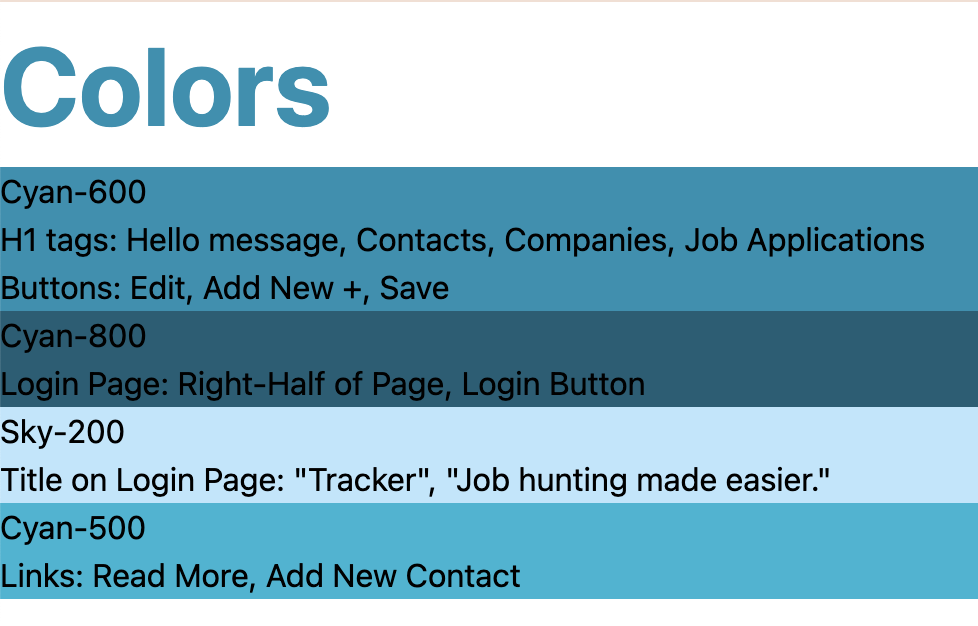
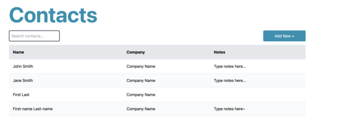
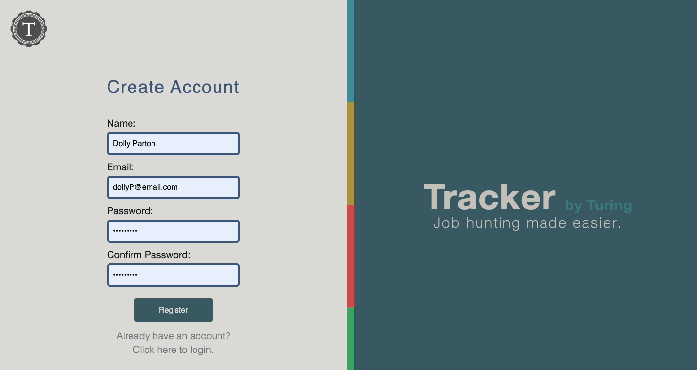
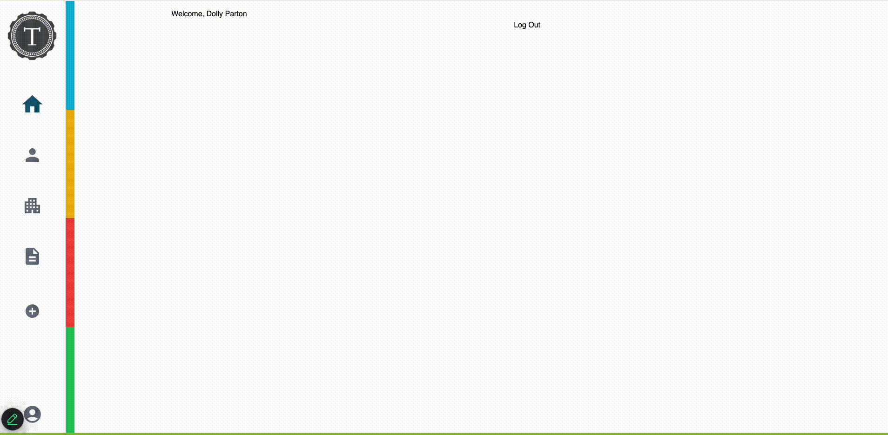
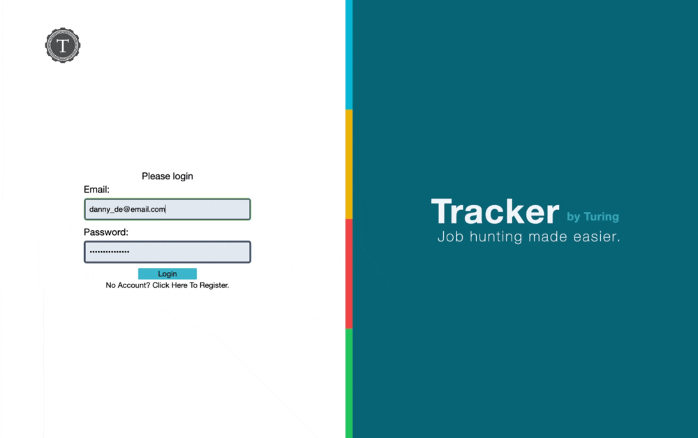
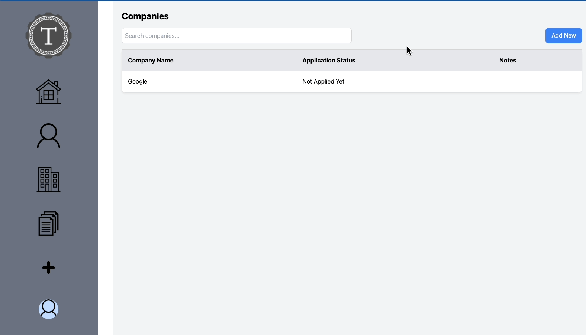
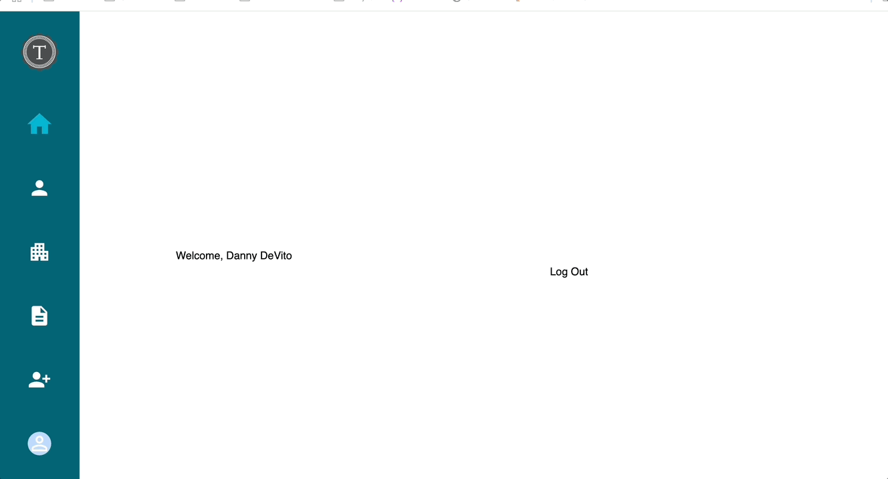
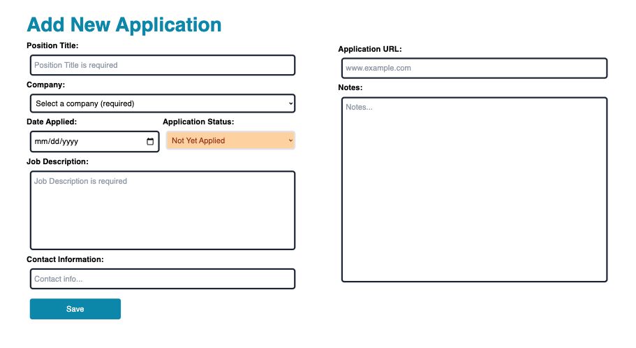
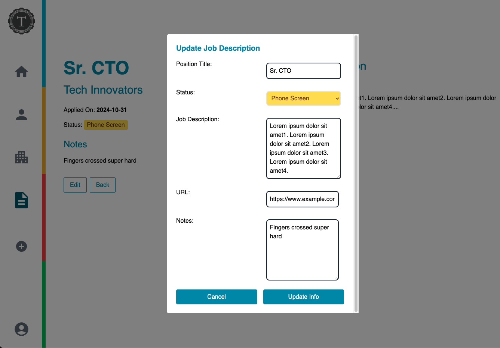

<a id="readme-top"></a>
<div style="display: flex; align-items: center; justify-content: center; gap: 1rem;">
  <a href="https://turing.edu/">
    
  </a>
  <h1 style="font-size: 3.5rem; margin: 0;">Tracker by Turing</h1>
</div>
<br />


<!-- TABLE OF CONTENTS -->
<details>
  <summary>Table of Contents</summary>
  <ol>
    <li>
      <a href="#about-the-project">About The Project</a>
      <ul>
        <li><a href="#built-with">Built With</a></li>
      </ul>
    </li>
    <li>
      <a href="#getting-started">Getting Started</a>
      <ul>
        <li><a href="#prerequisites">Prerequisites</a></li>
        <li><a href="#continuous-integration-ci">Continuous Integration (CI)</a></li>
        <li><a href="#installation">Installation</a></li>
      </ul>
    </li>
    <li><a href="#design-doc">Design Doc</a></li>
    <li><a href="#global-context">Global Context</a></li>
    <li><a href="#roadmap">Roadmap</a></li>
    <li><a href="#core-contributors">Core Contributors</a></li>
    <li><a href="#license">License</a></li>
  </ol>
</details>

<!-- ABOUT THE PROJECT -->
## About The Project


<p align="right">(<a href="#readme-top">back to top</a>)</p>

### Built With

* [![React][React.js]][React-url]
* [![TailwindCSS][TailwindCSS]][TailwindCSS-url]
* [![TypeScript][TypeScript]][TypeScript-url]
* [![Cypress][Cypress]][Cypress-url]
* [![CircleCI][CircleCI]][CircleCI-url]

<p align="right">(<a href="#readme-top">back to top</a>)</p>

<!-- GETTING STARTED -->
## Getting Started

### Prerequisites

* npm

  ```
  npm install npm@latest -g
  ```

### Continuous Integration (CI)

This project uses CircleCI for Continuous Integration (CI). To set up CircleCI for this repository:

1. **Sign Up for CircleCI**:

    - Visit [CircleCI](https://circleci.com/) and log in using your GitHub account.

2. **Authorize CircleCI**:

    - Allow CircleCI to access this repository.

3. **Add the Configuration File**:
    - Ensure the `.circleci/config.yml` file is present in the repository.
    - The current configuration uses Cypress for testing:

      ```yaml
      version: 2.1
      orbs:
        cypress: cypress-io/cypress@3.1.1
      workflows:
        build:
          jobs:
            - cypress/run:
                cypress-command: npx cypress run --headless
                start-command: npm start
      ```

4. **Verify the CI Pipeline**:

    - Push your changes to the `main` branch.
    - Navigate to the CircleCI dashboard to confirm that tests run successfully.

For more information, see the [CircleCI Documentation](https://circleci.com/docs/).

### Installation

1. Get a free API Key at [https://example.com](https://example.com)
2. Clone the repo
   ```sh
   git clone https://github.com/github_username/repo_name.git
   ```
3. Install NPM packages
   ```sh
   npm install
   ```
4. Change git remote url to avoid accidental pushes to base project
   ```sh
   git remote set-url origin github_username/repo_name
   git remote -v # confirm the changes
   ```

<p align="right">(<a href="#readme-top">back to top</a>)</p>

## Design Doc
Currently, we will be using Helvetica Neue Sans-Serif as our primary font, with the font size being set using vh/vw. 

Example: className="text-[5vw] font-[Helvetica Neue]"

(Note that most text should be Helvetica Neue by default, but if it isn't, setting it manually can be done as above.)

We will be refactoring to make use of MUI's SvgIcon icons, rather than images. Follow the following links for more information about how we'll be doing this:
https://mui.com/material-ui/getting-started/
https://mui.com/material-ui/material-icons/?query=home


We'll be using colors according to the image below.


For a form container, we'll be using something like this:
`<div className="w-[50vw] mx-auto my-[2vh] p-[3vh] ">`

while for our Save Button, we'll be following this example.
`bg-cyan-600 text-white px-[2vw] py-[1vh] rounded w-[10vw] hover:bg-cyan-700 focus:ring-cyan-500 focus:ring-2`

For our form boxes, we'll be using this styling.
`<label htmlFor="email" className="block text-gray-700 font-medium mb-[1vh]"> Email </label> <input className="w-full px-[1vh] py-[1vh] border border-gray-300 rounded-md focus:outline-none focus:ring-2 focus:ring-cyan-500" name="email"/>`


When we get text that's too long for our designated page area, we will cut that text off after a certain point, then insert a "Read More" button. This will open a modal containing the full version of the previously-truncated text.

When creating tables and forms, we'll be alternating between white and grey-100 for the background, and when we wish to create a button or search bars, we'll generally style them like this unless specifically told otherwise: 

 `<button className='bg-cyan-600 text-white p-[1vh] rounded w-[10vw]'>Add New +</button>`

`<input className='p-[1vh] border-2 border-slate-800 rounded w-[12vw] h-full' />`

`<input className='p-[1vh] border-2 border-slate-800 rounded w-[12vw] h-full' />`

For an example of what this might look like in practice, see below.



<!-- USER GLOBAL CONTEXT -->

## Global Context

### Implementing User Context With React's Context Hook

### Benefits

User Context has been implemented!! The use case for the context is getting access to a specific user's information and rather than doing a nightmare of imports and notations to get the info you need; you can call one line of code and get access to the session token for fetches and the loggedIn state for rendering! It keeps the code light, DRY, and easy to develope! Currently there are six pieces of info being given by the context. should there be a need / use case for adding more things to that we can add that at a later date!

### Right up front, here is a guide for implementation:

**$\text{\color{#f23030}PRE REQS:}$** $\text{\color{#f28730}The only requirement is that your component is being properly rendered in 'App.tsx' so make sure to check that first.}$

1. Import useUserLoggedContext into your component page:
   - $\text{\color{#9d7af5} import}\text{\color{#f5e97a} \\{ }\text{\color{#7adef5}useUserLoggedContext}\text{\color{#f5e97a} \\}}\text{\color{#9d7af5} from}\text{\color{#fca944} './context/UserLoggedContext.tsx'}$;

2. Destructure the function call ***INSIDE*** your component function:
   - $\text{\color{#2555a8} const}\text{\color{#f5e97a} \\{ }\text{\color{#0096db}token, roles, isLoggedIn, userData, userLogged, setUserData, clearUserLogged}\text{\color{#f5e97a} \\}}=\text{\color{#fca944} useUserLoggedContext}\text{\color{#9d7af5}()}$;

3. Use whatever part of the context you need!

### Additional Information

&nbsp;&nbsp;&nbsp;&nbsp;&nbsp;*<ins>At a base level React's [createContext](https://react.dev/reference/react/createContext) function allows a component to share some kind of data with other components that are wrapped in the context.</ins>*

### Traditional Implementation

&nbsp;&nbsp;&nbsp;&nbsp;&nbsp;Calling createContext returns a context object. **The context object itself does not hold any information;** it represents *which* part of the context other components can read or use to provide something to other components. Similar to how *useState* gives you a variable and a setter function that changes that variable; createContext gives you *two* functions, a $\text{\color{#7EE787}.Provider}$ and a **.Consumer**. The **.Consumer** function has been deemed a legacy way of consuming (using) the $\text{\color{#D1A7FD}value}$ distributed by the $\text{\color{#7EE787}.Provider}$ function, and so is no longer recommended. Instead the components that need access to the $\text{\color{#D1A7FD}value}$ that is destributed by the context will utilize the **useContext()** function to consume (use) the $\text{\color{#D1A7FD}value}$. Below is an example of the tradional implementation:

#### *<ins>AContextFile.tsx</ins>*

```coffeescript
import React, { createContext } from 'react';

export const AUserContextExample = createContext(null)
```
^ Here we have created our Context with a default value of $\text{\color{#79C0FF}null}$.

#### *<ins>AnAppFile.tsx</ins>*

```coffeescript
import React, { useState, useEffect, useContext } from 'react';
import AUserContextExample from '../contexts/AContextFile.tsx';

import aUserFetchCall from '../apiCalls/ApiCalls.tsx';
import <AnAwesomeComponent /> from '../components/AnAwesomeComponent.tsx';
import <AnEpicComponent /> from '../components/AnEpicComponent.tsx';
import <AnExtreameComponent /> from '../components/AnExtreameComponent.tsx';

async function App () {
  const [aUserState, setAUserState] = useState();

  useEffect(() => {
    const aFetchedUser = await aUserFetchCall();
    setAUserState(aFetchedUser);
  }, [])

  return (
    <aUserContextExample.Provider value={aUserState}>
      <div>
        <h1> Welcome To The Awesome App! </h1>
        <AnAwesomeComponent />
        <AnEpicComponent />
        <AnExtreameComponent />
      </div>
    </aUserContextExample.Provider>
  )
}
```
&nbsp;&nbsp;&nbsp;&nbsp;&nbsp;^ Here we are properly importing all the necessary pieces of our example application into our App component. As App is completing the mounting phase, we are initiating a fetch call to get a user and $\text{\color{#FFA657}set state}$ on the user object that is returned by the fetch call, $\text{\color{#D2A8FF}aUserFetchCall}{()}$. Upon App completing the mounting phase, it renders the JSX and passes the state variable, $\text{\color{#FFA657} aUserState}$ to the context $\text{\color{#D1A7FD} value}$ in the $\text{\color{#7EE787} aUserContextExample.Provider}$. The $\text{\color{#7EE787} aUserContextExample.Provider}$ is now ***providing*** its $\text{\color{#D1A7FD} value(s)}$ to the components that are nested inside it.

#### *<ins>AnAwesomeComponent.tsx</ins>*

```coffeescript
import React, { useContext } from 'react';
import AUserContextExample from '../contexts/AContextFile.tsx';

export Function AnAwesomeComponent () {
  const anAwesomeUser = useContext(AUserContextExample);

  return (
    <div>
      <h1>`Hello ${anAwesomeUser.name}! Welcome to the Awesome page!`</h1>
      <div>
        {
          anAwsomeUser.someSickAttributeToMap.map((srslyCoolThing) => {
            return (
              <div>
                <div>{srslyCoolThing.foReal}</div>
                <div>{srslyCoolThing.noCap}</div>
                <div>{srslyCoolThing.trulyGOATED}</div>
              </div>
            )
          })
        }
      </div>
    </div>
  )
}
```
&nbsp;&nbsp;&nbsp;&nbsp;&nbsp;^ Over in $\text{\color{#7EE787}AnAwsomeComponent}$; we import the $\text{\color{#D2A8FF}useContext}{()}$ function, set up a variable that equates to the $\text{\color{#D2A8FF}useContext}{()}$ function and pass $\text{\color{#FFA657}AUserContextExample}$ to it which gives us access to the $\text{\color{#D1A7FD}value(s)}$ ***provided*** by $\text{\color{#7EE787}aUserContextExample.Provider}$! From there we have access to the data in the $\text{\color{#FFA657}aUserState}$ variable we fetched and set back in App! With dot notation we can grab whatever pieces of data we need and run our code in this component.
</br>
</br>
### Tracker-CRM Implementation

### *<ins>TrackerContextFile.tsx</ins>*

```coffeescript
import React, { createContext, useState, useContext } from 'react';
import { UserData } from '../Interfaces';

interface Value {
  token: string | null,
  roles: string[] | null,
  isLoggedIn: boolean,
  userData: UserData,
  userLogged: Function,
  setUserData: Function,
  clearUserLogged: Function
}

const UserLoggedContext = createContext<null | Value>(null);

export function UserLoggedContextProvider({ children }: React.PropsWithChildren) {
  const [isLoggedIn, setIsLoggedIn] = useState(false);
  const [token, setToken] = useState<null | string>(null);
  const [roles, setRoles] = useState<[] | string[]>([]);
  const [userData, setUserData] = useState<UserData>({
    token: '',
    user: {
      data: {
        id: 0,
        type: 'user',
        attributes: {
          name: '',
          email: '',
          companies: []
        }
      }
    }
  });

  # Function to set the logged-in state
  const userLogged = (newToken: string, userRoles: string[]) => {
    setIsLoggedIn(true);
    setToken(newToken);
    setRoles(userRoles);
    console.log(userData, '<-- USER DATA SHOULD SET');
  };

  # Function to clear the logged-in state
  const clearUserLogged = () => {
    setIsLoggedIn(false)
    setToken(null);
    setRoles([]);
    setUserData({
      token: '',
      user: {(...)}
    });
    console.log(userData, '<-- USER DATA SHOULD CLEAR');
  };

  # Context value
  const value = {
    token,
    roles,
    isLoggedIn,
    userData,
    userLogged,
    setUserData,
    clearUserLogged,
  };

  return (
    <UserLoggedContext.Provider value={value}>
      {children}
    </UserLoggedContext.Provider>
  )
}

export const useUserLoggedContext = () => {
  const context = useContext(UserLoggedContext);
  if (!context) {
    throw new Error('useUserLogged must be used within a UserLoggedProvider');
  }
  return context;
}
```
&nbsp;&nbsp;&nbsp;&nbsp;&nbsp;^ In our Tracker-CRM project; we've executed the $\text{\color{#FFA657}userLoggedContext}$ in a slightly different way. Instead of importing the $\text{\color{#FFA657}userLoggedContext}$ ***directly*** into App.tsx in order to get access to the $\text{\color{#7EE787}.Provider}$ piece of the context; we have created a $\text{\color{#D2A8FF}UserLoggedContextProvider Component}$ that we can $\text{\color{#FFA657}export}$ and $\text{\color{#EE746C}import}$ like any other component.

$\text{\color{#d14141}Now here's where it gets dicey.}$

&nbsp;&nbsp;&nbsp;&nbsp;&nbsp;Instead of having App.tsx hold the $\text{\color{#FFA657}userData}$ state and pass it to every other component as props and pass a $\text{\color{#D2A8FF}handleUserLogin}$ function to the login component and pass the $\text{\color{#FFA657}session token}$; we've set up all (or at least most) of the $\text{\color{#FFA657}state data}$ we need ***inside*** this $\text{\color{#D2A8FF}UserLoggedContextProvider Component}$.

&nbsp;&nbsp;&nbsp;&nbsp;&nbsp;We've created a $\text{\color{#FFA657}value}$ variable that holds our various $\text{\color{#FFA657}state data}$, login ($\text{\color{#D2A8FF}userLogged}$) and logout ($\text{\color{#D2A8FF}clearUserLogged}$) functions, and the $\text{\color{#FFA657}session token}$. 

&nbsp;&nbsp;&nbsp;&nbsp;&nbsp;We then pass that $\text{\color{#FFA657}value}$ variable into the $\text{\color{#D2A8FF}value}$ property of the $\text{\color{#7EE787}UserLoggedContext.Provider}$.

Wait, if we aren't setting up the $\text{\color{#7EE787}.Provider}$ in App, how are we able to utilize the $\text{\color{#D2A8FF}value}$ property in our other components, you ask? 

*Think of the children!?*

&nbsp;&nbsp;&nbsp;&nbsp;&nbsp;In React, children are a special type of prop that allows components to recieve and render other components or elements. The `props.children` property **gives access to the content between the opening and closing tags of a parent component.** As you can see we have destructured the children property as the parameter for the $\text{\color{#D2A8FF}UserLoggedContextProvider}$ component, and then rendered the children in the return statement of $\text{\color{#D2A8FF}UserLoggedContextProvider}$ ***directly between*** the $\text{\color{#7EE787}UserLoggedContext.Provider}$. This is how we are able to give our components access to the context $\text{\color{#D2A8FF}values}$.

$\text{\color{#d14141}But we took it one step further.}$

You'll notice this bit of code underneath the $\text{\color{#D2A8FF}UserLoggedContextProvider}$ component:

```coffeescript
export const useUserLoggedContext = () => {
  const context = useContext(UserLoggedContext);
  if (!context) {
    throw new Error('useUserLogged must be used within a UserLoggedProvider');
  }
  return context;
}
```
&nbsp;&nbsp;&nbsp;&nbsp;&nbsp;^ We've created a $\text{\color{#D2A8FF}useUserLoggedContext}$ function (I know, I know we're using the same words alot here, the key point in this one is the word 'use' at the start there); and this is where the main bit of magic is. We've set up a functionally scoped $\text{\color{#FFA657}context}$ variable that equates to the $\text{\color{#D2A8FF}useContext}$() function from react and we've set the default value of this $\text{\color{#D2A8FF}useContext}$ to $\text{\color{#FFA657}userLoggedContext}$ which is the **original context we declared back up there above the** $\text{\color{#D2A8FF}UserLoggedContextProvider}$ component.
</br>&nbsp;&nbsp;&nbsp;&nbsp;&nbsp;Then we have an if statement checking the $\text{\color{#FFA657}context}$ variable for a falsey value meaning that if $\text{\color{#FFA657}context}$ equates to $\text{\color{#79C0FF}null}$ an error is thrown; otherwise it returns $\text{\color{#FFA657}context}$ which ultimately returns the $\text{\color{#FFA657}values}$ from the $\text{\color{#D2A8FF}UserLoggedContextProvider}$ function.

$\text{\color{#d14141}In other words, if a user is not logged in the context will be empty!}$

&nbsp;&nbsp;&nbsp;&nbsp;&nbsp;Now I bet you are wondering where we're using the $\text{\color{#7EE787}UserLoggedContextProvider}$ component... well even if you weren't I'll tell you any way.

### *<ins>index.js</ins>*

```coffeescript
import React from 'react';
import ReactDOM from 'react-dom/client';
import App from './App.tsx';
import reportWebVitals from './reportWebVitals';
import { BrowserRouter } from 'react-router-dom';
import { UserLoggedContextProvider } from './context/UserLoggedContext';
const root = ReactDOM.createRoot(document.getElementById('root'));
root.render(
  <BrowserRouter>
    <React.StrictMode>

      <UserLoggedContextProvider>
        <App />
      </UserLoggedContextProvider>

    </React.StrictMode>
  </BrowserRouter>
);
```
^ By wrapping the whole $\text{\color{#7EE787}App}$ component in the $\text{\color{#7EE787}UserLoggedContextProvider}$ component we can utilize the context in anything that App returns.

&nbsp;&nbsp;&nbsp;&nbsp;&nbsp;All this, heady theory stuff aside, structuring our context this way is what allows us to do one import and one line of code to get access to the user data and the session token. Please, if this has not cleared things up or if it could be explained better feel free to edit this README as necessary!
</br>&nbsp;&nbsp;&nbsp;&nbsp;&nbsp;Also if you have read this whole explaination; you're a beast!

<!-- ROADMAP -->
## Roadmap

### Feature 1 - Registration

Users must register their account to utilize this application.

The User Registration section allows new users to create an account by filling out all necessary fields with the requried information. Empty fields or invalid information throws specific errors instructing users to correct their mistake in order to proceed.

Existing users may click the 'login' link to directly navigate to the Login page.



### Feature 2 - Login
### Feature 3 - Home


The MenuBar component provides a responsive navigation interface for your application, designed for both desktop and mobile users. Here’s an overview of its functionality:

#### Desktop
* **Fixed Vertical Menu:** A static vertical navigation bar located on the left side of the screen, hidden on smaller screens.
* **Logo:** Clicking the logo redirects users to the home page.
* **Navigation Links:** Includes icons for navigating to key sections:
  * Home
  * Contacts
  * Companies
  * Job Applications
  * Account
* **Drop-Down Shortcut Menu:** Provides quick access to add new items:
  * Add New Contact
  * Add New Company
  * Add New Job Application

#### Mobile
* **Hamburger Menu:** A collapsible menu for smaller screens.
* **Slide-Out Menu:** A sidebar that slides in from the left when opened.
* **Close Button:** Closes the slide-out menu.
* **Navigation Links:** Similar to the desktop navigation, but tailored for mobile interaction.
* **Drop-Down Shortcut Menu:** A simplified version of the desktop drop-down, allowing quick actions for adding new contacts, companies, or job applications.

#### Additional UI Enhancements
* **Quad Color Bar:** A decorative vertical bar split into four colors, enhancing the visual design.




The home page/dash is where a user can see there weekly report.

Functionalities Include:

- User can see the job applications, contacts, and companies they have made for the week.
- as well as having a simple button to port you to add a new company 




### Feature 4 - Companies

The Companies section allows users to seamlessly manage a list of their companies. 

Key Functionalities Include:

- View All Companies:
Browse a comprehensive list of companies with detailed information such as company name, application status, and notes.
- View Company Details:
Click on a company to see detailed information on a dedicated page, including the company’s name, website, address, and notes. The details page also displays a list of associated contacts, making it easier to manage relationships and connections.
- Create a Company:
Add new companies by filling out a simple form with fields like name, website, address, and notes.
- Search for a Company:
Use the search bar to quickly find companies by name, enhancing efficiency and user experience.




### Feature 5 - Contacts

The Contacts section allows users to navigate their contacts.

Key Functionalities Include:

- View All Contacts:
Browse a comprehensive list of contacts with info like their name, company, and notes. Includes a search bar and ability to create a new contact.
- View a Contact:
Click on  a contact to see detail info on a dedicated page, such as their name, company, email address, phone number, notes and any other contacts associated with the company. Click on the other contacts to view their contact page. Click the contact's email address to open their mail client with an email to the contact. Click on the company name to view company name details.
- Add a new Contact
Click on the Add New + button to navigate to a form where a user inputs a new contact and their associated information.
- Search for a Contact
Use the search bar to quickly find a contact by name, enhancing efficiency and user experience.



<p align="right">(<a href="#readme-top">back to top</a>)</p>

### Feature 6 - Job Applications

- View All Job Applications:

- View A Job Application:

- Create A Job Application:
Add a new job application by filling out a form with fields for Position Title, Company, Date Applied, Application Status, Job Description, Application URL, and Notes.
Choose a company that exists under your profile.



- Edit A Job Application:
Edit several of the fields of an application that has already been input into the system to stay up to date on where in the process the application is at.


<!-- CONTRIBUTING -->

<p align="right">(<a href="#readme-top">back to top</a>)</p>

## Core Contributors:
<!-- 
HEY YOU!!!! Keep it in alphabetical by last name!!!
FORMAT: lastname, firstname 
  - github link 
  - linkedin link
  -->

**Banks, Charles**
- [Github](https://github.com/DRIF7ER)
- [LinkedIn](https://www.linkedin.com/in/charles-t-banks-jr-6b982b152//)

**Bloom, Stefan**
- [Github](https://github.com/stefanjbloom)
- [LinkedIn](https://www.linkedin.com/in/stefanjbloom/)

**Chirchirillo, Joe**
- [Github](https://github.com/jchirch)
- [LinkedIn](https://www.linkedin.com/in/joechirchirillo/)

**Cirbo, Candice**
- [Github](https://github.com/ccirbo)
- [LinkedIn](https://www.linkedin.com/in/candicecirbo/)

**Croy, Lito**
- [Github](https://github.com/litobot)
- [LinkedIn](https://www.linkedin.com/in/litocroy/)

**Delaney, Kyle**
- [Github](https://gist.github.com/kylomite)
- [LinkedIn](https://www.linkedin.com/in/kylehamptondelaney/)

**De La Rosa, Melchor**   
- [Github](https://github.com/MDelarosa1993)
- [LinkedIn](https://www.linkedin.com/in/melchordelarosa/)

**Galvin, Shane**
- [Github](https://github.com/sgalvin36)
- [LinkedIn](https://www.linkedin.com/in/shane-galvin36/)

**Hill, John**
- [Github](https://github.com/jphill19)
- [LinkedIn](https://www.linkedin.com/in/johnpierrehill/)

**Hotaling, Marshall**
- [Github](https://github.com/marshallhotaling)
- [LinkedIn](https://www.linkedin.com/in/marshall-hotaling-7b52a8304/)

**Macur, Jim**
- [Github](https://github.com/jimmacur)
- [LinkedIn](https://www.linkedin.com/in/jimmacur/)

**Messersmith, Renee**
- [Github](https://github.com/reneemes)
- [LinkedIn](https://www.linkedin.com/in/reneemessersmith/)

**O'Leary, Ryan**
- [Github](https://github.com/ROlearyPro)
- [LinkedIn](https://www.linkedin.com/in/ryan-o-leary-6a963b211/)

**Pintozzi, Erin - (Project Manager)**
- [Github](https://github.com/epintozzi)
- [LinkedIn](https://www.linkedin.com/in/erin-pintozzi/)

**Riley, Alora**
- [Github](https://github.com/aloraalee)
- [LinkedIn](https://www.linkedin.com/in/alorariley/)

**Wallace, Wally**
- [Github](https://github.com/wally-yawn)
- [LinkedIn](https://www.https://www.linkedin.com/in/wally-wallace-719b0875/)

<p align="right">(<a href="#readme-top">back to top</a>)</p>


<!-- LICENSE -->
## License

Distributed under the MIT License. See `LICENSE.txt` for more information.

<p align="right">(<a href="#readme-top">back to top</a>)</p>


<!-- MARKDOWN LINKS & IMAGES -->
<!-- https://www.markdownguide.org/basic-syntax/#reference-style-links -->
[React.js]: https://img.shields.io/badge/React-20232A?style=for-the-badge&logo=react&logoColor=61DAFB
[React-url]: https://reactjs.org/
[TypeScript]: https://img.shields.io/badge/TypeScript-3178C6?style=for-the-badge&logo=typescript&logoColor=white
[TypeScript-url]: https://www.typescriptlang.org/
[TailwindCSS]: https://img.shields.io/badge/TailwindCSS-38B2AC?style=for-the-badge&logo=tailwindcss&logoColor=white
[TailwindCSS-url]: https://tailwindcss.com/
[Cypress]: https://img.shields.io/badge/Cypress-17202C?style=for-the-badge&logo=cypress&logoColor=white
[Cypress-url]: https://www.cypress.io/
[CircleCI]: https://img.shields.io/badge/CircleCI-343434?style=for-the-badge&logo=circleci&logoColor=white
[CircleCI-url]: https://circleci.com/

