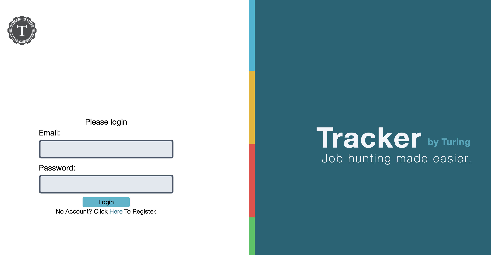
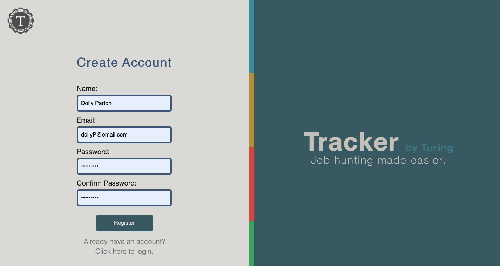
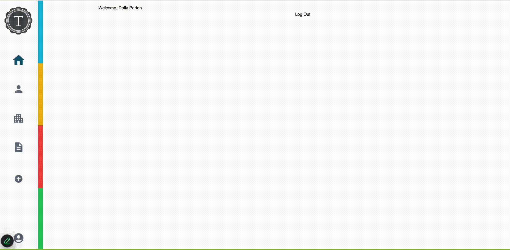
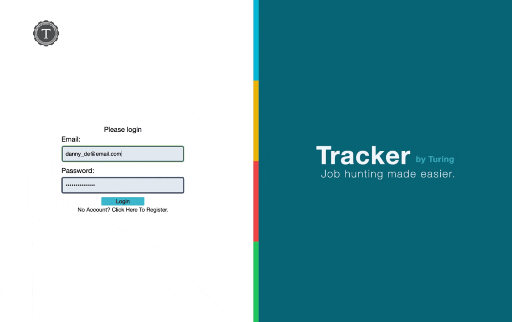
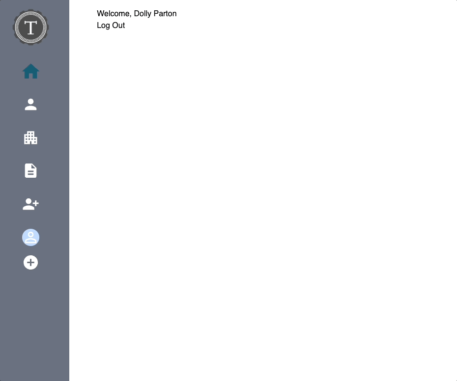
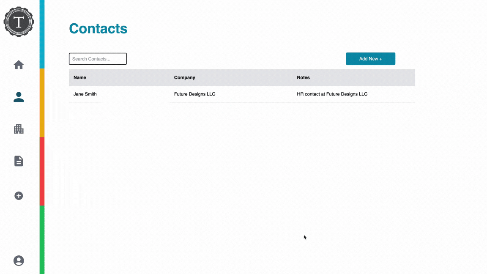
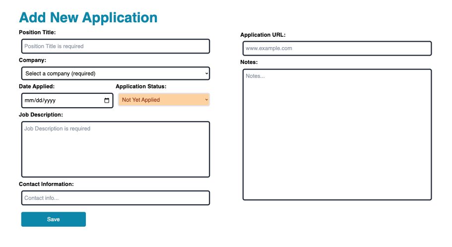
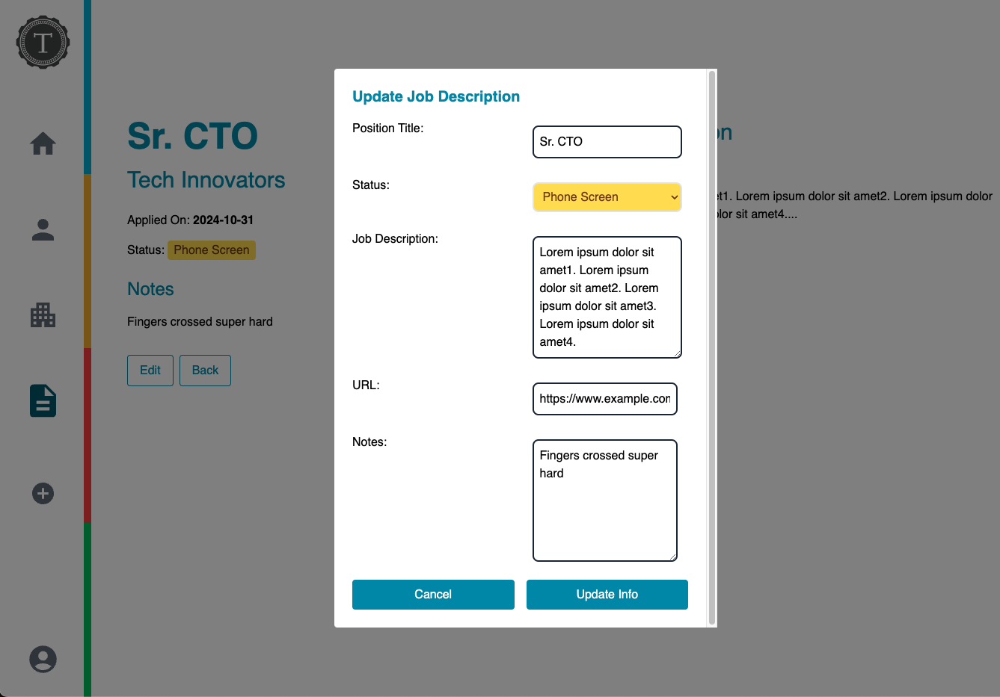
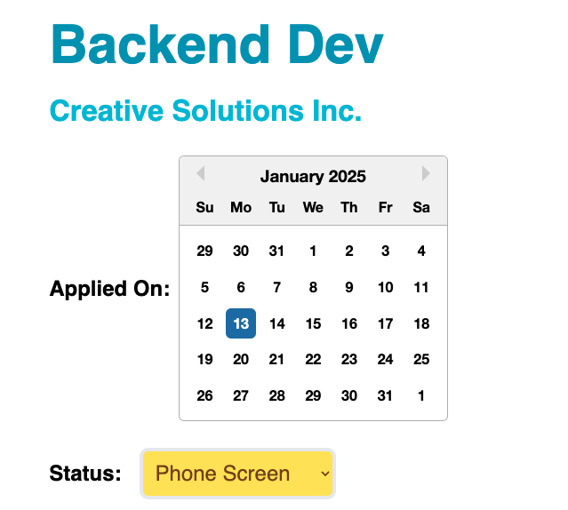
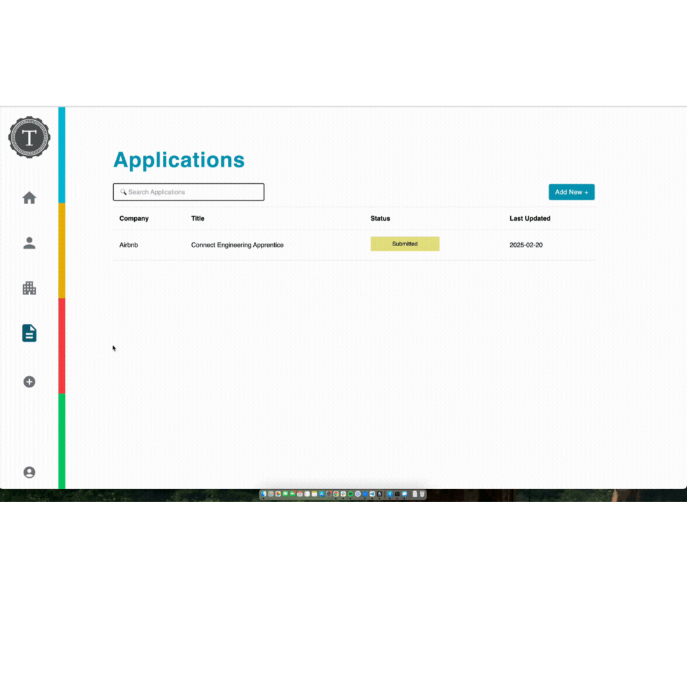

<a id="readme-top"></a>

<div style="display: flex; align-items: center; justify-content: center; gap: 1rem;">
  <a href="https://turing.edu/">
    
  </a>
  <h1 style="font-size: 3.5rem; margin: 0;">Tracker by Turing</h1>
</div>
<br />

<!-- TABLE OF CONTENTS -->
<details>
  <summary>Table of Contents</summary>
  <ol>
    <li>
      <a href="#about-the-project">About The Project</a>
      <ul>
        <li><a href="#built-with">Built With</a></li>
      </ul>
    </li>
    <li>
      <a href="#getting-started">Getting Started</a>
      <ul>
        <li><a href="#prerequisites">Prerequisites</a></li>
        <li><a href="#continuous-integration-ci">Continuous Integration (CI)</a></li>
        <li><a href="#installation">Installation</a></li>
      </ul>
    </li>
    <li><a href="#design-doc">Design Doc</a></li>
    <li><a href="#roadmap">Roadmap</a></li>
    <li><a href="#core-contributors">Core Contributors</a></li>
    <li><a href="#license">License</a></li>
  </ol>
</details>

<!-- ABOUT THE PROJECT -->

## About The Project



<p align="right">(<a href="#readme-top">back to top</a>)</p>

### Visit Our Site

Vist the [Tracker Site](https://tracker-crm-fe-38f7cf1aaca5.herokuapp.com/)

### Built With

- [![React][React.js]][React-url]
- [![TailwindCSS][TailwindCSS]][TailwindCSS-url]
- [![TypeScript][TypeScript]][TypeScript-url]
- [![Cypress][Cypress]][Cypress-url]
- [![CircleCI][CircleCI]][CircleCI-url]
- <div align="left">
  <a href="https://tiptap.dev/">
    
  </a>
</div>

<p align="right">(<a href="#readme-top">back to top</a>)</p>

<!-- GETTING STARTED -->

## Getting Started

### Prerequisites

- npm

  ```
  npm install npm@latest -g
  ```

### Continuous Integration (CI)

This project uses CircleCI for Continuous Integration (CI). To set up CircleCI for this repository:

1. **Sign Up for CircleCI**:

   - Visit [CircleCI](https://circleci.com/)
   - Click "Log in"
   - Click "Log in" button on the authorize page
   - Click the text that says, "Signed up for CircleCI with GitHub or Bitbucket before September 2023?"
   - Log in with GitHub

2. **Authorize CircleCI**:

   - Allow CircleCI to access this repository.

3. **Add the Configuration File**:

   - Ensure the `.circleci/config.yml` file is present in the repository.
   - The current configuration uses Cypress for testing:

     ```yaml
     version: 2.1
     orbs:
       cypress: cypress-io/cypress@3.1.1
     workflows:
       build:
         jobs:
           - cypress/run:
               cypress-command: npx cypress run --headless
               start-command: npm start
     ```

4. **Verify the CI Pipeline**:

   - Push your changes to the `main` branch.
   - Navigate to the CircleCI dashboard to confirm that tests run successfully.

For more information, see the [CircleCI Documentation](https://circleci.com/docs/).

### Installation

1. Clone the repo
   ```sh
   git clone https://github.com/github_username/repo_name.git
   ```
2. Install NPM packages
   ```sh
   npm install
   ```

<p align="right">(<a href="#readme-top">back to top</a>)</p>

## Styling

### Font

` Helvetica Neue Sans-Serif`

Example: `className="text-[5vw] font-[Helvetica Neue]"`

### Icons

[MUI's SvgIcon icons](https://mui.com/material-ui/material-icons/?query=home)

### Colors & Sizes

 #### <u>Containers</u>

`<div className="w-[50vw] mx-auto my-[2vh] p-[3vh] ">`

#### <u>H1 Tags</u>

**_Cyan-600_**

#### <u>Buttons</u>

***Cyan-600***

`<div bg-cyan-600 text-white px-[2vw] py-[1vh] rounded w-[10vw] hover:bg-cyan-700 focus:ring-cyan-500 focus:ring-2>`  

#### <u>Links</u>  
***Cyan-500**  

### <u>Login Page</u>  

***Cyan-800*** for right half and login button  
***Sky-200*** for Login Page Title

#### <u>Form Boxes</u>
`<label htmlFor="email" className="block text-gray-700 font-medium mb-[1vh]"> Email </label> <input className="w-full px-[1vh] py-[1vh] border border-gray-300 rounded-md focus:outline-none focus:ring-2 focus:ring-cyan-500" name="email"/>`

<!-- ROADMAP -->

## Roadmap

### Feature 1 - Registration

Users must register their account to utilize this application.

The User Registration section allows new users to create an account by filling out all necessary fields with the requried information. Empty fields or invalid information throws specific errors instructing users to correct their mistake in order to proceed.

Existing users may click the 'login' link to directly navigate to the Login page.



### Feature 2 - Login

![User Login]

### Feature 3 - Home

The MenuBar component provides a responsive navigation interface for your application, designed for both desktop and mobile users. Here’s an overview of its functionality:

#### Desktop

- **Fixed Vertical Menu:** A static vertical navigation bar located on the left side of the screen, hidden on smaller screens.
- **Logo:** Clicking the logo redirects users to the home page.
- **Navigation Links:** Includes icons for navigating to key sections:
  - Home
  - Contacts
  - Companies
  - Job Applications
  - Account
- **Drop-Down Shortcut Menu:** Provides quick access to add new items:
  - Add New Contact
  - Add New Company
  - Add New Job Application

#### Mobile

- **Hamburger Menu:** A collapsible menu for smaller screens.
- **Slide-Out Menu:** A sidebar that slides in from the left when opened.
- **Close Button:** Closes the slide-out menu.
- **Navigation Links:** Similar to the desktop navigation, but tailored for mobile interaction.
- **Drop-Down Shortcut Menu:** A simplified version of the desktop drop-down, allowing quick actions for adding new contacts, companies, or job applications.

#### Additional UI Enhancements

- **Quad Color Bar:** A decorative vertical bar split into four colors, enhancing the visual design.



The home page/dash is where a user can see there weekly report.

Functionalities Include:

- User can see the job applications, contacts, and companies they have made for the week.
- as well as having a simple button to port you to add a new company



### Feature 4 - Companies

The Companies section allows users to seamlessly manage a list of their companies.

Key Functionalities Include:

- View All Companies:
  Browse a comprehensive list of companies with detailed information such as company name, application status, and notes.
- View Company Details:
  Click on a company to see detailed information on a dedicated page, including the company’s name, website, address, and notes. The details page also displays a list of associated contacts, making it easier to manage relationships and connections.
- Create a Company:
  Add new companies by filling out a simple form with fields like name, website, address, and notes (includes rich text formatting when text is selected).
- Update a Company:
  Click the Edit button on a company's details page to open a modal. Modify any field, including the company name, website, address, state, or notes, and save the changes effortlessly.
- Search for a Company:
  Use the search bar to quickly find companies by name, enhancing efficiency and user experience.
- Delete a Company:
  Click on the delete button in the company details page to remove a company. A confirmation modal will appear to verify the decision before proceeding. Deleting a company does not remove its associated contacts.



### Feature 5 - Contacts

The Contacts section allows users to navigate their contacts.

Key Functionalities Include:

- View All Contacts:
  Browse a comprehensive list of contacts with info like their name, company, and notes. Includes a search bar and ability to create a new contact.
- View a Contact:
  Click on a contact to see detail info on a dedicated page, such as their name, company, email address, phone number, notes and any other contacts associated with the company. Click on the other contacts to view their contact page. Click the contact's email address to open their mail client with an email to the contact. Click on the company name to view company name details.
- Edit a Contact:
  Click edit in show contact page to open a modal that will enable a contact to be edited. First name and last name are required fields and the rest are optional. To exit the modal without saving changes, click the x in the corner or outside of the modal to close it. To save changes, click the save button. The modal will automatically close and the changes will be immediately viewable on your contact page.
- Delete a Contact:
  Click delete in show contact page to remove a contact, with a modal to verify the decision.
- Add a new Contact
  Click on the Add New + button to navigate to a form where a user inputs a new contact and their associated information. The notes section includes rich text formatting when text is selected. The user has the ability to add a new company here as well.
- Search for a Contact
  Use the search bar to quickly find a contact by name, enhancing efficiency and user experience.



<p align="right">(<a href="#readme-top">back to top</a>)</p>

### Feature 6 - Job Applications

- View All Job Applications:

- View A Job Application:

- Delete a Job Application: Click delete in the show job application page to remove a job application, with a modal to verify the decision. After the job application is successfully deleted you will be returned to the main job application page.

- Create A Job Application:

Add a new job application by filling out a form with fields for Position Title, Company, Date Applied, Application Status, Job Description, User Contacts, Application URL, and Notes (includes rich text formatting when text is selected).
Choose a company that exists under your profile.



- Edit A Job Application:
  Edit several of the fields of an application that has already been input into the system to stay up to date on where in the process the application is at.



- Edit an Application Date or Status: Job application dates and statuses can also be edited directly on the job application page. Dates can be changed by clicking on the "Applied On" date to pull up an interactive calendar, and clicking on a new date. Statuses can be changed by clicking on the current status and selecting a new status from the dropdown.
  

- Practice Interview: Ten technical interview questions are generated based on the job description you share. These questions are to help prepare for a potential interview.


<!-- CONTRIBUTING -->

<p align="right">(<a href="#readme-top">back to top</a>)</p>

## Core Contributors:

<!--
HEY YOU!!!! Keep it in alphabetical by last name!!!
FORMAT: lastname, firstname
  - github link
  - linkedin link
  -->

**Banks, Charles**

- [Github](https://github.com/DRIF7ER)
- [LinkedIn](https://www.linkedin.com/in/charles-t-banks-jr-6b982b152//)

**Bleggi, Jillian**

- [Github](https://github.com/jbleggi)
- [LinkedIn](https://www.linkedin.com/in/jillianbleggi/)

**Bloom, Stefan**

- [Github](https://github.com/stefanjbloom)
- [LinkedIn](https://www.linkedin.com/in/stefanjbloom/)

**Cardona, Danielle**

- [Github](https://github.com/dcardona23)
- [LinkedIn](https://www.linkedin.com/in/danielle-cardona-se/)

**Chirchirillo, Joe**

- [Github](https://github.com/jchirch)
- [LinkedIn](https://www.linkedin.com/in/joechirchirillo/)

**Cirbo, Candice**

- [Github](https://github.com/ccirbo)
- [LinkedIn](https://www.linkedin.com/in/candicecirbo/)

**Cochran, James**

- [Github](https://github.com/James-Cochran)
- [LinkedIn](https://www.linkedin.com/in/james-cochran-/)

**Croy, Lito**

- [Github](https://github.com/litobot)
- [LinkedIn](https://www.linkedin.com/in/litocroy/)

**Davalos, Joel**

- [Github](https://github.com/jdavalos98)
- [LinkedIn](https://www.linkedin.com/in/joeldavalos/)

**Delaney, Kyle**

- [Github](https://gist.github.com/kylomite)
- [LinkedIn](https://www.linkedin.com/in/kylehamptondelaney/)

**De La Rosa, Melchor**

- [Github](https://github.com/MDelarosa1993)
- [LinkedIn](https://www.linkedin.com/in/melchordelarosa/)

**Fallenius, Karl Frederick**

- [Github](https://github.com/SmilodonP)
- [LinkedIn](https://www.linkedin.com/in/karlfallenius)

**Galvin, Shane**

- [Github](https://github.com/sgalvin36)
- [LinkedIn](https://www.linkedin.com/in/shane-galvin36/)

**Haefling, Matt**

- [Github](https://github.com/mhaefling)
- [LinkedIn](www.linkedin.com/in/matthew-haefling)

**Hill, John**

- [Github](https://github.com/jphill19)
- [LinkedIn](https://www.linkedin.com/in/johnpierrehill/)

**Hotaling, Marshall**

- [Github](https://github.com/marshallhotaling)
- [LinkedIn](https://www.linkedin.com/in/marshall-hotaling-7b52a8304/)

**Knapp, Paul**

- [Github](https://github.com/Paul-Knapp)
- [LinkedIn](www.linkedin.com/in/paul-m-knapp)

**Lynch, Devlin**

- [Github](https://github.com/devklynch)
- [LinkedIn](https://www.linkedin.com/in/devlin-lynch/)

**Macur, Jim**

- [Github](https://github.com/jimmacur)
- [LinkedIn](https://www.linkedin.com/in/jimmacur/)

**Manning, Terra**

- [Github](https://github.com/TDManning)
- [LinkedIn](https://www.linkedin.com/in/terra-manning/)

**Messersmith, Renee**

- [Github](https://github.com/reneemes)
- [LinkedIn](https://www.linkedin.com/in/reneemessersmith/)

**Newland, Kevin**

- [Github](https://github.com/kevin-newland)
- [LinkedIn](https://www.linkedin.com/in/kevin-newland/)

**O'Brien, Michael**

- [Github](https://github.com/MiTOBrien)
- [LinkedIn](https://www.linkedin.com/in/michaelobrien67/)

**O'Leary, Ryan**

- [Github](https://github.com/ROlearyPro)
- [LinkedIn](https://www.linkedin.com/in/ryan-o-leary-6a963b211/)

**Pintozzi, Erin - (Project Manager)**

- [Github](https://github.com/epintozzi)
- [LinkedIn](https://www.linkedin.com/in/erin-pintozzi/)

**Riley, Alora**

- [Github](https://github.com/aloraalee)
- [LinkedIn](https://www.linkedin.com/in/alorariley/)

**Salazar, Kaelin**

- [Github](https://github.com/kaelinpsalazar)
- [LinkedIn](https://www.linkedin.com/in/kaelin-salazar/)

**Sommers, Jono**

- [Github](https://github.com/JonoSommers)
- [LinkedIn](https://www.linkedin.com/in/jonosommers/)

**Vasquez, Natasha**

- [Github](https://github.com/nvnatasha)
- [LinkedIn](https://www.linkedin.com/in/natasha-vasquez/)

**Verrill, Seth**

- [Github](https://github.com/sethverrill)
- [LinkedIn](https://www.linkedin.com/in/sethverrill/)

**Wallace, Wally**

- [Github](https://github.com/wally-yawn)
- [LinkedIn](https://www.linkedin.com/in/wally--wallace/)

**Ward, Elysa**

- [Github](https://github.com/elysableu)
- [LinkedIn](https://www.linkedin.com/in/elysa-ward/)

**Weiland, Kristin**

- [Github](https://github.com/KMPWeiland)
- [LinkedIn](https://www.linkedin.com/in/kristinweiland/)

**Willett, Bryan**

- [Github](https://github.com/bwillett2003)
- [LinkedIn](https://www.linkedin.com/in/bryan--willett/)

<p align="right">(<a href="#readme-top">back to top</a>)</p>

<!-- LICENSE -->

## License

Distributed under the MIT License. See `LICENSE.txt` for more information.

<p align="right">(<a href="#readme-top">back to top</a>)</p>

<!-- MARKDOWN LINKS & IMAGES -->
<!-- https://www.markdownguide.org/basic-syntax/#reference-style-links -->

[React.js]: https://img.shields.io/badge/React-20232A?style=for-the-badge&logo=react&logoColor=61DAFB
[React-url]: https://reactjs.org/
[TypeScript]: https://img.shields.io/badge/TypeScript-3178C6?style=for-the-badge&logo=typescript&logoColor=white
[TypeScript-url]: https://www.typescriptlang.org/
[TailwindCSS]: https://img.shields.io/badge/TailwindCSS-38B2AC?style=for-the-badge&logo=tailwindcss&logoColor=white
[TailwindCSS-url]: https://tailwindcss.com/
[Cypress]: https://img.shields.io/badge/Cypress-17202C?style=for-the-badge&logo=cypress&logoColor=white
[Cypress-url]: https://www.cypress.io/
[CircleCI]: https://img.shields.io/badge/CircleCI-343434?style=for-the-badge&logo=circleci&logoColor=white
[CircleCI-url]: https://circleci.com/


